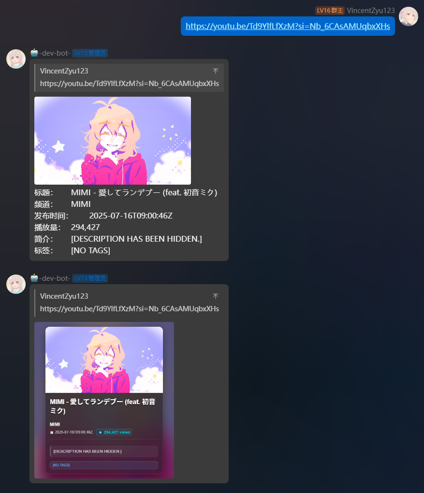
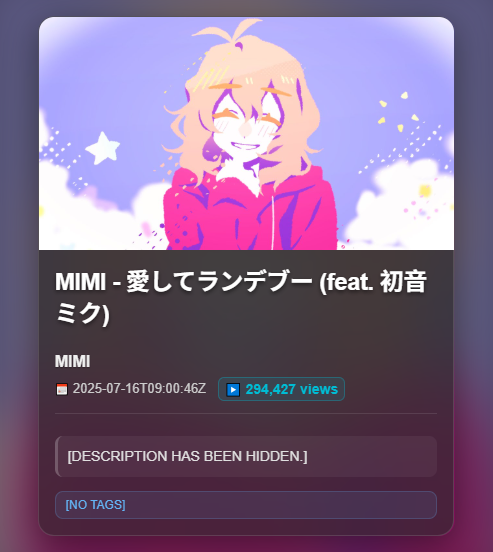

# koishi-plugin-youtube-vincentzyu-fork

<!-- [](https://www.npmjs.com/package/koishi-plugin-youtube) -->
[](https://www.npmjs.com/package/koishi-plugin-youtube-vincentzyu-fork)


> youtube plugin for koishi, vincentzyu fork version
> forked from https://github.com/H4M5TER/koishi-plugin-youtube

## preview



## How to use

### google api key
* 根据Google开发者文档指引，创建一个app并且打开v3 api，记下你的apikey
  [YouTube Data API Overview  |  Google Developers](https://developers.google.com/youtube/v3/getting-started)

> 
* 将apikey填入到koishi后台插件配置中并且启用youtube插件
* 插件将会自动识别群聊里的YouTube视频链接并返回视频预览内容等等，包含以下两种：
  * https://youtu.be/{id}
  * https://www.youtube.com/watch?v={id}

### work mode
* 支持两种工作模式： `standalone` 和 `distributed`

### proxy
* 我只测了socks5 axios，其他的不知道(能不能用(

-----

## Dev
```shell
cd G:\GGames\Minecraft\shuyeyun\qq-bot\koishi-dev\koishi-dev-3
npm login --registry https://registry.npmjs.org
npm run pub youtube-vincentzyu-fork -- --registry https://registry.npmjs.org  
npm view koishi-plugin-youtube-vincentzyu-fork --registry https://registry.npmjs.org
npm dist-tag add koishi-plugin-youtube-vincentzyu-fork@2.0.0-vincentzyufork.alpha.3+20251007 latest --registry https://registry.npmjs.org
```

---

## commit msg

### commit 3ee8d4f6c5c8743d31eeecf3a4516a019e3a01e4 (HEAD -> master)
- Author: 84 bawuyinguo root <1830540513zyu@gmail.com>
- Date:   Sun Feb 1 17:21:33 2026 +0800

  > 2.0.0-vincentzyufork.beta.1+20260201 refactor: 拆分config配置文件 & 增强调试日志输出 & 添加emoji美化

### 前面的
  > 忘了，反正你看到的features都是前面更新的